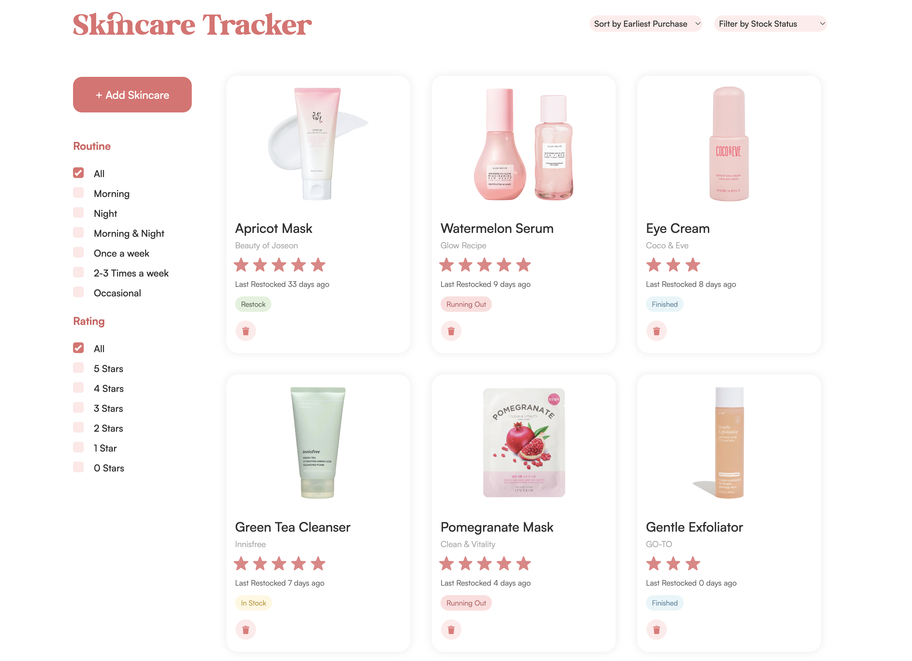

# Skincare Product Tracker

## Table of Contents

- [Overview](#overview)
- [Version Control](#version-control)
- [Key Features](#key-features)
  - [Skincare Products Tracking](#skincare-products-tracking)
  - [Skincare Products Display](#skincare-products-display)
  - [Organising Products by Routine](#organising-products-by-routine)
  - [Filtering Products by Stock Status](#filtering-products-by-stock-status)
  - [Skincare Dashboard](#skincare-dashboard)
  - [User Interface](#user-interface)
- [Setup](#setup)
- [Usage](#usage)
- [Development Documentation & Iterations](#development-documentation-&-iterations)
- [Limitations & Future Inclusions](#limitations-and-future-inclusions/extensions/improvements)
- [Reflection](#reflection)
- [Acknowledgements](#acknowledgements)
- [Reference List](#reference-list)

## Overview

This skincare product tracker is a single-page application (SPA) that allows users to add, save and track skincare products they have used previously, currently use and/or want to use, at any time in one place. It is built using HTML, CSS and JavaScript and saves data on tracked products using `localStorage` to persist across infinite visits for singular devices. It is responsive for both desktop and mobile devices. This web application offers a user-friendly interface accompanied by a simple and efficient function to view the user's personalised skincare tracker, add new skincare products and relevant details, sort the order of skincare products in their tracker and filter them by their stock status, rating and skincare routine. Users can also view a skincare data dashboard at the top of the skincare tracker, which provides a brief overview of their skincare products and how many to restock as insight to their current routine. It also links users to skincare product recommendations that align to their skin type and specific needs to get started with the tracker. The aim of this web-app is to make it easier for users to track their skincare products and gain a better understanding of what products and routines works for their needs. It is targetted towards heath-conscious individuals passionate or want to gain a better understanding of skincare and skin health, and want to perfect a suitable and consistent skincare routine through the products they use.

For the purpose of this small-scale tracker demonstration, [**13 skincare product test values**](#usage) are provided to log into the skincare tracker to demonstrate its use. You can find these values to test the tracker in the [Usage](#usage) section. Other products can also be tracked, but these will not be linked to their respective skincare product images yet. More details for this are provided in the [Limitations and Future Inclusions](#limitations-and-future-inclusions) section.

## Version Control

This project utilises Git and Github to track and commit changes to the code development. You can view the full Git repository [here](#https://github.com/purvibothra/pbot0186-tracker).

## Key Features

### Skincare Products Tracking

- **Add New Skincare Products**: Users can add new skincare products using the "add skincare" button. Through a pop-up input form, users can track the effectiveness of products by providing details such as the product name, brand, a URL link to the product for reference, what routine it is used for, the stock status, skincare product category, the cost, date it was last purchased, a rating (using a 5 star metric) and comments. Comments can detail the product's effectiveness and edited overtime after seeing results, such as the texture, feeling, quality, any skin reactions and more to justify its rating and if the user should continue using it. The stock status is so the user knows whether they should restock a product, if it's close to running out, if they have yet to buy it (wishlist), or if they stopped using it.
- **Edit Skincare Products**: Once a skincare product has been added to the user's tracker, users can click into existing product cards to view all the product information. From this pop-up, users can edit the skincare product information such as update the stock status, add more comments, or change their rating overtime.
- **Delete Skincare Products**: Products can be removed directly from the card at any time if no longer needed.

### Skincare Products Display

- **Product Cards**: Each skincare product added by the user is displayed as a card with its image, product name, brand, rating, days since the last restock, and stock status. This card concisely and efficiently details significant information about the skincare product for the user's reference and for memorability.
- **Skincare Product Information**: Users can click into existing cards to view all relevant information input by the user, including skincare product information that is not included on the product card.
- **Sorting Options**: Users can customise how they view products in the tracker by sorting through 4 different criteria: in alphabetical order, by earliest purchase (older purchases first), by latest purchase (newer purchases first), or the date added to the tracker. The default sort is the earliest purchase so users can view older products that may need replacing or restocking in their routine.
- **Filtering Options**: Users can filter the skincare products in their tracker by the skincare routine to view products for each routine, by ratings, and by stock status to quickly find specific items.

### Organising Products by Routine

- **Routine Filter**: Users can build an effective skincare routine overtime for the morning/night/week/month as they see fit by categorising and filtering skincare products in their tracker by the specific routine. This is a primary filtering option provided as a checklist filter on the side of the tracker and a drop-down for mobile.

### Organising Products by Rating

- **Rating Filter**: Users can view their skincare product list by highly rated products that work well for their skin, or low rated products they have tried previously to avoid purchasing again or recommending to others. This is also a primary filtering option that is a checklist under the routine filter and uses a drop-down for mobile.

### Filtering Products by Stock Status

- **Stock Status Filter**: This is a secondary filter option that uses a drop-down select, users can filter products by the stock status. This provides an efficient view of products, such as those on their wishlist that they have yet to purchase, or only viewing products that need to be restocked to save time. Users can hence update and monitor products. Viewing the date of last purchase (last restock) of products can help manage the user's skincare inventory and keep track of product expiry.

### Skincare Dashboard

- **Find Suitable Products**: Users can be linked to an accessible quiz to better understand their skin type, needs, potential allergens and more, while also being recommended suitable skincare products to get new users started with skincare products to track.
- **Product Counter**: This counter keeps track of the number of skincare products in the user's current routine as insight into the effectiveness of their skincare routine.
- **Restock Product Counter**: Users can efficiently view how many products in their tracker they need to restock as an efficient way to manage their inventory be concious of product expiry.

### User Interface

- **Responsive Design**: The application is designed to be responsive, ensuring a seamless experience across various desktop and mobile.
- **Efficient Navigation**: Users can navigate to the skincare dashboard or skincare tracker at any time with a fixed navigation bar. Users with a longer skincare product list on desktop can scroll to the top of the web-page for efficiency.

## Setup

### Prerequisites

- A modern web browser (e.g., Chrome, Firefox, Safari)
- Node.js (optional, for running a local development server and managing dependencies)

### Installation & Access

There are 3 options to start using the web-app:

1. **Link to Web-app**: View the website online at the following URL: [Tracker Link](https://purvibothra.github.io/pbot0186-tracker/)

   - You can also use the following URL to the GitHub file to clone the repository for further development: [GitHub Page](https://github.com/purvibothra/pbot0186-tracker)

2. **Manual Setup**: Locate the index.html file in your project directory. Double-click the file to open it in your default web browser. You can also open the file from VS Code and click "Go Live" to launch the server.

## Usage

Once the tracker web page is open, you can begin tracking your skincare products by selecting the red "add skincare" button under the skincare tracker section. Add product details (product name and brand are the only required fields as these are the most memorable identifications for the product) and then click "add" to add and begin tracking the skincare product. From there, you can filter products by the drop-down stock status select, the routine and rating checkboxes, and sort the tracker list as desired. You can also delete products you have added using the 'delete' icon button on the cards, or click into existing cards to view information or edit the product details.

### Test Values

This web-app has 13 test values (skincare products) to test and demonstrate the use of the skincare tracker. When you add a new product, in the
_"Product Name"_ text field, you can write any of these options:

- **Green Tea Cleanser**
- **Apricot Mask**
- **Gentle Exfoliator**
- **Pomegranate Mask**
- **Rose Mask**
- **Avocado Mask**
- **Long Wear Makeup Remover**
- **Daily Facial Moisturiser**
- **Watermelon Serum**
- **Salicylic Spot Treatment**
- **SPF 50+ Sunscreen**
- **Rose Water Toner**
- **Eye Cream**

These values are mapped to an image of the skincare product and the brand to display on the product card. In real use, the product image would be derived from the thumbnail of the product URL link provided by the user, but due to security limitations in the local server, default values are mapped as a demonstration. You can also use other product names and brands but they are not linked to an image.

## Development Documentation & Iterations

After submitting the wireframes for the web app, I did not receive any major feedback on the layout and design of the tracker, so I started with plans on replicating the original wireframe layout whilst including branding elements, with most iterations being made **during development** and after gaining feedback from users during small-scale **user tests.** The original wireframes can be found [here](https://drive.google.com/file/d/17thHaNVrF5oCMP5i-2lA3K4sC6NziFbf/view?usp=sharing).

### Development Approach

I started with developing the HTML and CSS structure of the web-app following the wireframes, including the landing screen, dashboard, skincare tracker container and titles, and the 'perfect skincare' section before developing functionality for the tracker using JavaScript. The approach to each element is documented extensively as code comments in the code files. I started with coding the functionality of adding a product by creating the pop-up input form, then designing the cards, designing the pop-up for existing cards, adding the sort and filter options, and the dashboard counters. Below outlines some improvements I made from the original wireframe as I developed the tracker, and refined the tracker from external feedback.

### Branding & Visual Aesthetic

I had an idea of the type of branding I wanted the web application to have whilst developing the wireframe, and experimented with these ideas during development. I wanted to use soft colours to highlight the therapeutic feeling that many get from skincare and using skincare products (as this is a form of self-care), which is why I decided on white, pink and a deep pinkish-red as the primary colour palette. I did need to darken the red colour for clear contrast against the pink background to increase contrast and hence accessibility. The softness is extended to the wavy backdrop of the landing screen, and use of round shapes in the pop-up form, input fields and product cards. I chose the font "Milk And Honey" to perpetuate the warm feeling of using skincare, and "Satoshi" as the main font for legibility and accessibility. The design of the web-app is simple and uses minimalist design patterns to enhance rather than obscure the user's experience of using the skincare tracker.

### Iterations from Self-Evaluation

- **Placement of 'Add Skincare' Button**

In the original wireframe, the 'add skincare' button to add a new product to track was styled and positioned in the same place as the skincare product cards, but "fixed" to the beginning of the product card list. This was for clear visibility and accessibility, enabling users to instinctively associate the button to its purpose (adding a skincare product card). However, during development and viewing the button with the same dimensions of the card, I decided it looked quite large and obscured from the user's full view of the skincare tracker. I decided to move the button to add new products to track to the left of the skincare tracker (following the user's eyeline of naturally viewing content from left to right) and making the button slightly smaller but salient through the dark red accent colour. This would make the button accessible for the user whilst not obscuring their view of the tracker.

- **Placement of 'Rating' Input on Input Form**

In the wireframe, all form input fields including the star rating are all located on the right column of the form (in desktop view). I iterated this by placing 'Rating' on the left under the image to consider screen sizes and visibility. Originally, having all form elements on the right looked cluttered which interfered legibility and distinction between different input fields. Moving the rating to the left would enhance the experience and visibility of each input field without overwhelming the user.

- **Removing the Confirmation before Deleting Items**

Originally, there is a confirmation pop-up before the user deletes a skincare product as an error prevention method, in case they pressed delete accidentally. Although this is best practice, I decided to remove the confirmation as this is a small-scale demonstration and this extra step can interfere with the user's experience. However, I have detailed in the Limitations & Future Inclusions section of the potential to include this feature for a more larger scale implementation of the tracker.

- **Replacing Skincare Recommendations with Quiz in Skincare Dashboard**

Instead of a section in the skincare dashboard that recommends the user a product type after analysing data in their current skincare tracker list, I replaced this with a link to a skincare quiz from the Sephora website that will recommend the user skincare products according to their needs, to get started with skincare products to track. I decided this would be more relevant and accurate than a limited recommendation system created using JavaScript, especially if the user has minimal products in their tracker. The recommendation would also have to take into account the user's specific needs with products, which would be too complex to account for at this time.

### Iterations from User Testing & Feedback

<u>**User Testing Purpose & Protocol**</u>

After developing the first draft of the skincare tracker with basic functionality (being able to add products to the tracker, sort and filter them), I designed a user testing protocol with 3 tasks for users to test the functionality and provide feedback on the experience for improvement. I tested the web-app with 5 users who use skincare products in a moderated (in-person) format. User testing transcripts were recorded using the Voice Memos app and observations were noted during tested. I used the following methods for testing:

- **Pre-test Interview**: Short interview asking users if they have a skincare routine, are interested in developing/improving their skincare routine, and currently track skincare products to validate their legibility to test the web app.
- **Think-Aloud**: Recording users' comments as they interact with the web-app, to better understand their thought processes, any instinctive thoughts or actions, assumptions or pain points.
- **Observations**: Observing how users interact with the tracker, including what they click, how they process and react to information, etc.
- **Post-test Interview**: Verbal feedback from users on what they enjoyed, found useful and what they think can be improved.
- **SUS Survey**: Quantitative feedback using this website on the overall usability of the web-app

<u>**User Testing Results & Feedback**</u>

In terms of the web-app's overall usability and effectiveness, results from user testing were high. It received a System Usability Score of **94** and positive feedback on the branding and visual aesthetic, simple user interface and ease of use. However, there were some iterations made based on user's feedback on what would be most effective if they were to use the tracker consistently.

- **Replacing the Product Category Filter with Stock Status**

Next to the sort drop-down, originally users could filter the skincare product tracker by the product category (i.e. Exfoliators, Moisturisers, etc). However, a user mentioned during testing that it would make more sense to filter by stock status, as individuals usually don't use more than one product category in their routine (i.e. typically don't use more than one type of exfoliator). I decided that to maximise use and applicability, the filter option would be changed to stock status for users to better manage their inventory.

- **Replacing the Perfect Skincare Section with a Rating Filter**

In the wireframes, the web page had 3 sections, where the last section was where users could view all their 5-star rated products ("Perfect Skincare" section). Although during testing only the structure of this feature was developed but not the functionality, multiple users noted that it would be more efficient to be able to filter the actual skincare tracker list to see highly rated products instead of having a separate collection at the end (which may not be as accessible, especially for trackers with multiple products). I decided to instead remove this feature and included a checklist filter for the product ratings under the routine filter for efficiency.

## Limitations & Future Inclusions/Extensions/Improvements

To build upon the work and consider future improvements or extensions, the following are some recommendations from reflecting on the process of developing this skincare tracker.

### Use of `localStorage`

The web-app uses `localStorage` to save and store data, but this is limited as it only persists for a specific browser or device, as this is not shared across the user's devices (i.e. if opened from a new device or browser, the user won't be able to see skincare products tracked from the previous browser/device). This can be improved by potentially using a backend database such as relational databases (MySQL, PostgreSQL, or SQLite if the web-app will continue to be used on a server) or noSQL databases such as MongoDB or Firebase. These databases will need to be set up, installed and configured. Other options to store data would be using a cloud platform, which can provide a central location and accessible from any device such as AWS S3 or Google Cloud Storage.

### Thumbnail Image for any Skincare Product

Currently, users can add any skincare product to the tracker, however the product image will only update for the demo products. For implementation, looking into ways to extract the thumbnail image from the product URL link (after the user inputs this into the 'product link' field) and updating the product image to the thumbnail can be used. Using metadata such as Open Graph, a Proxy Server, backend service or API to fetch the HTML content from external links. Another option would be having users upload their own image of the product, but the former may be more efficient.

### Filtering Options

For the web-app, users can filter the skincare product list by the routine, rating, and stock status. It may be worth incorporating other and all available filtering options such as a product price range and filtering by product category. However, the current options are suitable for individual skincare trackers that usually do not have more than 10 products being used at a time. Additionally, because the stock status uses a drop-down as a filter, as well as the mobile filtering options, there is potential to add a checklist to the drop-down so users can select multiple options at once for flexibility.

### Extend Skincare Dashboard

There is potential to add more data elements to track in the skincare tracker, such as number of 5-star products. More user research should be conducted to better understand what users would find useful to view on their dashboard about their current skincare routine and product use.

### Delete Confirmation

As mentioned earlier, I removed the confirmation before deleting for efficiency considering its limited scope. However, I believe it is best practice to include this as an error prevention method if the web-app was developed and implemented widely.

### Different Currency Options

Currently, users can only use the '$' dollar currency option. For wider accessibility and usability, a drop-down select can be used for users to change the currency to their local currency for cost accuracy. This can also be extended to the language of the skincare tracker, to consider a more diverse demographic.

### Increase Accessibility & Responsiveness

In the future, there is potential to increase accessibility, such as offering a dark-mode option, testing with assistive technologies such as screen-readers and keyboard-only navigation can also promote inclusive use. Creating a responsive design for other devices such as tablets as well can maximise use.

## Reflection

Developing this web-app was an enlightening and insightful experience, as this was my first time using HTML, CSS and JavaScript to build a functional and interactive web application. Although this process was enriching and rewarding, I did have many issues, specifically with using JavaScript to manifest the functionality I had planned for the web-app. I learned about the level of detail applied to all interactive elements, as there are many factors to consider even for a single button click. Initial difficulties were counteracted by referring to in-class tutorial activities, W3Schools to understand the purpose behind certain elements and selectors and how to manipulate them, and ChatGPT (OpenAI) to help me debug my code whenever it was not working, format and clean it up, and suggest ways I can approach creating certain functions. These are also listed in [Acknowledgements](#acknowledgements). Overall, the web-app is functional and aligns with the original layout and user flow designed in the wireframes, accompanied with iterations that considered the entirety of the user experience to enhance accessibility, usability and efficiency.

## Acknowledgements

W3Schools for code reference & help: W3Schools. (2024). W3Schools Online Web Tutorials. Retrieved from https://www.w3schools.com/

DECO2017 Canvas Lectures & Tutorial Activities: Advanced Web Design. (2024). Retrieved from https://canvas.sydney.edu.au/courses/56508

OpenAI for the following purposes (also highlighted in code comments): OpenAI. (2023). _ChatGPT_ [Large language model]. https://www.openai.com/

- For using the startsWith() method to create a string starting with $
- For creating formula to sort products by date
- For creating constant to identify each product card in variable by its ID
- For creating constant to ensure only the card user deleted product from deletes
- For formula to convert time to days
- For removing errors in innerHTML of product card
- For understanding how to attach event listener to product cards
- For removing errors in alphabetical sort function
- To check filtering condition for stock status, rating and routine
- For creating functionality on how to uncheck 'All' option when others are checked and vice versa
- For creating scroll intervals for scroll-to-top button
- How to center absolute text in the middle of screen
- How to have a default select option
- Re-order product category options in alphabetical order

## Reference List

### Code Help & References

Advanced Web Design. (2024). Retrieved from
https://canvas.sydney.edu.au/courses/56508

Five star rating field with animated hover effect. (2015, December 20). Retrieved from
https://codepen.io/blixt/details/QyNXEp

Juviler, J. (2024, March 4). How to Add a CSS Fade-in Transition Animation to Text, Images, Scroll & Hover. Retrieved from
https://blog.hubspot.com/website/css-fade-in

MDN. (2023, April 7). Node: insertBefore() method - Web APIs | MDN. Retrieved from
https://developer.mozilla.org/en-US/docs/Web/API/Node/insertBefore

Milk And Honey Font | dafont.com. (n.d.). Retrieved from
https://www.dafont.com/milk-and-honey.font

Olwanle, J. (2022, July 29). Sort Alphabetically in JavaScript – How to Order by Name in JS. freeCodeCamp.Org. Retrieved from
https://www.freecodecamp.org/news/how-to-sort-alphabetically-in-javascript/

OpenAI. (2023). _ChatGPT_ [Large language model].
https://www.openai.com/

Satoshi Font Family—Download Free Font. (n.d.). Retrieved from
https://befonts.com/satoshi-font-family.html

W3Schools. (2024). W3Schools Online Web Tutorials. Retrieved from
https://www.w3schools.com/

Vijayan, D. (n.d.). Pure CSS Animated Mouse Scroll Icon. Retrieved from
https://codepen.io/2xsamurai/details/WwmjKQ

W3Schools. (n.d.-a). CSS flex-basis property. Retrieved from
https://www.w3schools.com/cssref/css3_pr_flex-basis.php

W3Schools. (n.d.-b). CSS @font-face Rule. Retrieved from
https://www.w3schools.com/cssref/css3_pr_font-face_rule.php

W3Schools. (n.d.-c). CSS Layout—The z-index Property. Retrieved from
https://www.w3schools.com/css/css_z-index.asp

W3Schools. (n.d.-d). CSS object-fit Property. Retrieved from
https://www.w3schools.com/css/css3_object-fit.asp

W3Schools. (n.d.-e). How To Create a Custom Checkbox and Radio Buttons. Retrieved from
https://www.w3schools.com/howto/howto_css_custom_checkbox.asp

W3Schools. (n.d.-f). How To Create a Custom Checkbox and Radio Buttons. Retrieved from
https://www.w3schools.com/howto/howto_css_custom_checkbox.asp

W3Schools. (n.d.-g). How To Search for Items in a Dropdown. Retrieved from
https://www.w3schools.com/howto/howto_js_filter_dropdown.asp

W3Schools. (n.d.-h). HTML button tag. Retrieved from
https://www.w3schools.com/tags/tag_button.asp

W3Schools. (n.d.-i). HTML DOM Element addEventListener() Method. Retrieved from
https://www.w3schools.com/jsref/met_element_addeventlistener.asp

W3Schools. (n.d.-j). HTML DOM Element addEventListener() Method. Retrieved from
https://www.w3schools.com/jsref/met_element_addeventlistener.asp

W3Schools. (n.d.-k). HTML DOM Element innerHTML Property. Retrieved from
https://www.w3schools.com/jsref/prop_html_innerhtml.asp

W3Schools. (n.d.-l). HTML DOM Element setAttribute() Method. Retrieved from
https://www.w3schools.com/jsref/met_element_setattribute.asp

W3Schools. (n.d.-m). HTML DOM Style color Property. Retrieved from
https://www.w3schools.com/jsref/prop_style_color.asp

W3Schools. (n.d.-n). HTML input type="checkbox". Retrieved from
https://www.w3schools.com/tags/att_input_type_checkbox.asp

W3Schools. (n.d.-o). HTML select tag. Retrieved from
https://www.w3schools.com/tags/tag_select.asp

W3Schools. (n.d.-p). JavaScript Array forEach() Method. Retrieved from
https://www.w3schools.com/jsref/jsref_foreach.asp

W3Schools. (n.d.-q). JavaScript Array sort() Method. Retrieved from
https://www.w3schools.com/jsref/jsref_sort.asp

W3Schools. (n.d.-r). JavaScript String startsWith() Method. Retrieved from
https://www.w3schools.com/jsref/jsref_startswith.asp

W3Schools. (n.d.-s). Responsive Web Design Media Queries. Retrieved from
https://www.w3schools.com/css/css_rwd_mediaqueries.asp

WebAIM. (n.d.). WebAIM: Contrast Checker. Retrieved from
https://webaim.org/resources/contrastchecker/

Week 4 Content: Advanced Web Design. (2024). Retrieved from
https://canvas.sydney.edu.au/courses/56508/pages/week-4-content?module_item_id=2244482

Week 7 Content: Advanced Web Design. (2024). Retrieved from
https://canvas.sydney.edu.au/courses/56508/pages/week-7-content?module_item_id=2244492

Week 10 Content: Advanced Web Design. (2024). Retrieved from
https://canvas.sydney.edu.au/courses/56508/pages/week-10-content

### Sources for Images & Content

BEAUTY OF JOSEON Apricot Blossom Peeling Gel: Amazon.com.au: Beauty. (2021). Retrieved from https://www.amazon.com.au/BEAUTY-JOSEON-Apricot-Blossom-Peeling/dp/B09KH1NN7B/ref=asc_df_B09KH1NN7B/?tag=googleshopdsk-22&linkCode=df0&hvadid=463938904715&hvpos=&hvnetw=g&hvrand=14966490930786767248&hvpone=&hvptwo=&hvqmt=&hvdev=c&hvdvcmdl=&hvlocint=&hvlocphy=9071791&hvtargid=pla-1643657695375&psc=1&mcid=d48e69c034323b2e86c8271afee9b619

Bobbi Brown Instant Long-Wear Makeup Remover 100ml | MECCA. (2019). Retrieved from https://www.mecca.com/en-au/bobbi-brown/instant-long-wear-makeup-remover-100ml-I-012471/?gad_source=1&gclid=CjwKCAjwgpCzBhBhEiwAOSQWQX1wCR_GSTyrRJppj_tZF42EWN5DfmPAbALa2NndqRZ-ucL8iKc5kBoCqLQQAvD_BwE&gclsrc=aw.ds

Brighten Your Eyes with Coco & Eve Depuff Eye Cream. (n.d.). Adore Beauty. Retrieved from https://www.adorebeauty.com.au/p/coco-eve/depuff-eye-cream.html

Essano Hydration Daily Facial Moisturiser with Rosehip and Hyaluronic Acid Tube 100ml. (n.d.). Retrieved from https://www.chemistwarehouse.com.au/buy/135668/essano-hydration-daily-facial-moisturiser-with-rosehip-and-hyaluronic-acid-tube-100ml?gad_source=1&gclid=CjwKCAjwgpCzBhBhEiwAOSQWQQrs4Lpcb3EcFDk1GtghqIb9OctHG0jyDd9xKjFzV_FoWPhMgkr2fRoCat0QAvD_BwE&gclsrc=aw.ds

Gentle Exfoliator | Balancing Glow Toner | Go-To Skincare. (2022). Retrieved from https://gotoskincare.com/products/gentle-exfoliator?tw_source=google&tw_adid=&tw_campaign=20044028623&gad_source=1&gclid=CjwKCAjwgpCzBhBhEiwAOSQWQZogDdVHUXcwxJg50U0DFVeuOA8-4n5iAG3EOrwS4yzV_OHDBvXZLRoC3P8QAvD_BwE

Glow Recipe Watermelon Dew Drops 40ml | MECCA. (n.d.). Retrieved from https://www.mecca.com/en-au/glow-recipe/watermelon-glow-niacinamide-dew-drops-40ml-I-047284/?gad_source=1&gclid=CjwKCAjwgpCzBhBhEiwAOSQWQSMrMGfeda1NQJD0ovGLWAl1fu122sii2HZ7lLOUJsQy32Tr2h3ZpRoCqjoQAvD_BwE&gclsrc=aw.ds

Go-To Face Hero Protective Face Oil 30ml | MECCA. (n.d.). Retrieved from https://www.mecca.com/en-au/go-to/face-hero-30ml-I-038679/

Green Tea Hydrating Amino Acid Cleansing Foam (150g). (2021). Keoji. Retrieved from https://www.keoji.com.au/products/innisfree-green-tea-foam-cleanser

I’m Real Avocado Mask Sheet (Nutrition). (n.d.). Nudie Glow. Retrieved from https://nudieglow.com/products/tony-moly-im-real-avocado-mask-sheet-nutrition

It`s skin Rose Moisture & Vitality Sheet Mask (Pack of 10): Amazon.com.au: Beauty. (2020). Retrieved from https://www.amazon.com.au/%60s-skin-Moisture-Vitality-Sheet/dp/B07HNDX8ZH

It’S SKIN - The Fresh Mask Sheet 1pc (10 Types). (n.d.). YesStyle. Retrieved from https://www.yesstyle.com/en/its-skin-the-fresh-mask-sheet-1pc-10-types/info.html/pid.1051489359

Kids Everyday Sensitive Sunscreen SPF 50+. (n.d.). Natio. Retrieved from https://www.natio.com.au/products/kids-everyday-sensitive-sunscreen-spf-50

Rose Water Toner 250ml. (n.d.). Lila Beauty. Retrieved from https://lilabeauty.com.au/products/rose-water-toner-250ml

Skin Care Quiz | Sephora. (n.d.). Retrieved from https://www.sephora.com/beauty/skin-care-quiz
